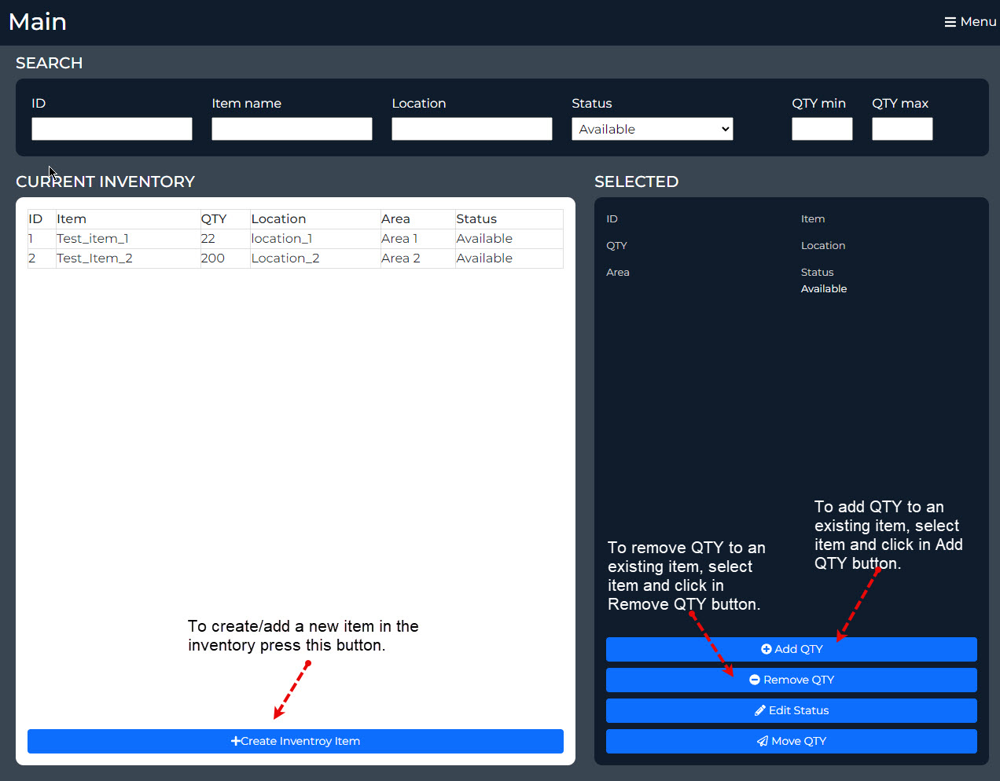
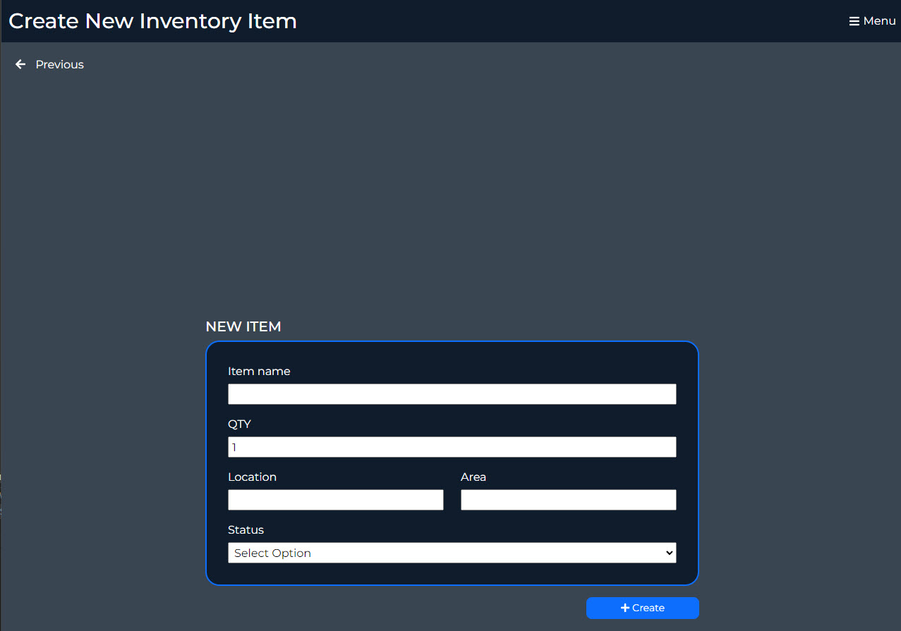

# Prototype for Web Application Inventory Control System (WAICS)

## Description
In this portion of the project, I have a prototype of some of the functionlaitites of the web application for the inventory control system.
The main page of the prototype is to load the information of the currect list of items in the list. I have only left two as to show in the list,
but more can be added using the create inventory bottom. This button will take to the page where users can enter the information for the new item. 

The focus of this prototype is to test the functionalities of Creating a new item, adding QTY, and Removing QTY. Some other functionalitites are 
present suck as the search by ID and Status. 

The idea behind the adding and removing the QTYs is to add or remove the QTY entered but in this face the user has to add the new QTY left for the item. 

## Main

## Create Invetory Page

