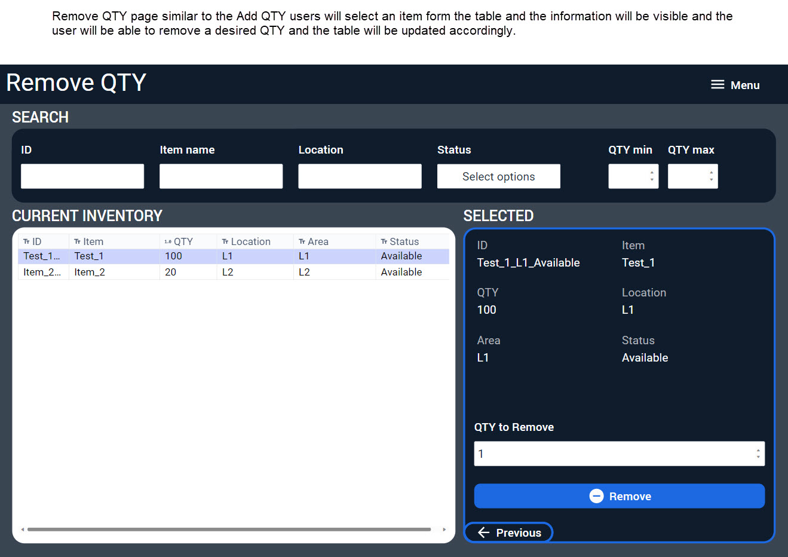

# Web Application Inventory Control System (WAICS)
Table of Contents:

[Introduction](https://github.com/renzochong/-WAICS-/blob/main/README.md#Introduction)   
[Data Component](https://github.com/renzochong/-WAICS-/blob/main/README.md#Data-Component)   
[System Interface](https://github.com/renzochong/-WAICS-/blob/main/README.md#System-Interface)   
[Project Plan](https://github.com/renzochong/-WAICS-/blob/main/README.md#Project-Plan)   
[Wireframe Sketches First Drafts](https://github.com/renzochong/-WAICS-/blob/main/README.md#Wireframe-Sketches-First-Drafts)   
[User Stories](https://github.com/renzochong/-WAICS-/blob/main/README.md#user-stories)  
[Use Cases](https://github.com/renzochong/-WAICS-/blob/main/README.md#use-cases)  
[(UML) Use Case Diagram](https://github.com/renzochong/-WAICS-/blob/main/README.md#UML-Use-Case-Diagram)   
[Requirements Table](https://github.com/renzochong/-WAICS-/blob/main/README.md#Requirements-Table)   
[Chen-notation Entity Relationship Diagram (ERD)](https://github.com/renzochong/-WAICS-/blob/main/README.md#Chen-ERD)   
[Class Diagram](https://github.com/renzochong/-WAICS-/blob/main/README.md#Class-Diagram)   
[Data Access Layer](https://github.com/renzochong/-WAICS-/blob/main/README.md#Data-Access-Layer)

## Introduction
In today's fast-paced business environment, efficient and effective inventory management is crucial. The Web Application Inventory Control System (WAICS) is envisioned as a comprehensive solution to address the complexities and challenges of modern inventory management. Its purpose is to streamline and automate the processes of tracking, managing, and analyzing inventory across multiple channels and locations. Key features include real-time inventory tracking, automated stock alerts, integration with sales and purchase order systems, detailed analytics, and multi-platform support. The system focuses on enhancing efficiency, accuracy, and decision-making in inventory management using advanced technology. WAICS will feature a centralized database, robust API for secure data access, and multi-tiered user access control, catering to diverse business needs in the fast-paced modern business environment.

## Purpose and Functionality
The primary purpose of WAICS is to offer businesses a unified platform for inventory management that is both scalable and adaptable to diverse operational needs. The high-level functional requirements include:

## Data Component
### Data Storage
The core of WAICS will be its centralized database where diverse inventory-related data will be stored
###	Data Sources
Data will be sourced from multiple channels.
###	Data Access via API
Access to the database will be managed through a well-defined API. This RESTful API will ensure secure and efficient communication between the database and various client applications. 
###	Data Usage
The stored data will be utilized in various ways

## System Interface
### Multi-Platform Support
The system will be designed to support multiple applications, catering to different user needs. These applications will interact with the central database via the API, ensuring a unified data source despite varied access points. 

## User Roles and Access Control
WAICS will feature a multi-tiered access control system to ensure users only access data and functionalities relevant to their roles.

##	Real-Time Inventory Tracking
A key feature will be real-time inventory tracking, enabling businesses to have up-to-the-minute information about their stock levels, reducing overstocking or stockouts, and improving overall inventory turnover.

##	Literature Survey
To ensure the project's success, a comprehensive survey of existing literature on inventory management systems, API integration, and multi-platform application development will be conducted. 

##	Comparison with Similar Software
A comparative analysis will be conducted with similar systems like SAP Inventory Management, Oracle NetSuite, and Zoho Inventory. 

##	Project Plan
The project will be executed in phases:
1)	Requirement Analysis and Planning: Detailed requirements gathering and project scope definition.
2)	System Design: Architectural design of the database and API, and interface design for various platforms.
3)	Development: Coding, API integration, and application development.
4)	Testing: Rigorous testing for functionality, performance, and security.
5)	Deployment and Training: System deployment and user training.
6)	Maintenance and Upgrades: Ongoing support and system enhancements.

##	Input, Processing, and Output
###	Input
•	Manual data entries by users.
•	Data from external systems via API.
•	Bulk data uploads.
###	Processing
•	Data validation and storage in the database.
•	Data analysis for trends and insights.
•	Automated triggers for stock alerts and reorders.
###	Output
•	Real-time inventory reports and dashboards.
•	Alerts and notifications.
•	Analytical insights for inventory optimization.
 
## Conclusion
WAICS is set to be a transformative solution in inventory management, leveraging the latest in technology to offer a flexible, reliable, and efficient system. Through its comprehensive data management, robust API, and versatile interfaces, WAICS will provide unparalleled control and insights into inventory processes. This proposal outlines a clear vision and roadmap for the system's development, ensuring its alignment with the evolving needs of modern businesses.

### More details can be found in [project proposal document](https://github.com/renzochong/-WAICS-/blob/main/ProposalDoc/Detailed_Proposal_WAICS_RenzoChongFlores.pdf).

# Wireframe Sketches First Drafts
## Main

## Add QTY Page

## Remove QTY Page

## Create Inventory Item

# User Stories:
1. **Inventory Manager Story:**
   - As an inventory manager, I want to access real-time inventory tracking, so that I can have up-to-the-minute information about stock levels to prevent overstocking or stockouts.

2. **Sales Associate Story:**
   - As a sales associate, I need to receive automated stock level alerts and reorder notifications, so I can efficiently manage inventory and ensure product availability for customers.

3. **Business Analyst Story:**
   - As a business analyst, I require detailed reporting and analytics for inventory performance, to make data-driven decisions and improve inventory efficiency.

4. **System Administrator Story:**
   - As a system administrator, I want to manage user roles and access control, ensuring that each team member has the appropriate level of access to the inventory system.

5. **IT Specialist Story:**
   - As an IT specialist, I need to integrate the inventory system with existing sales and purchase order systems through APIs, to ensure seamless data flow and operational efficiency.

# Use Cases:
1. **Use Case for Real-time Inventory Tracking:**
   - **Actor:** Inventory Manager
   - **Description:** View and manage inventory levels in real-time across multiple channels and locations.
   - **Preconditions:** User is logged in with inventory manager access.
   - **Main Flow:** User accesses the dashboard to view current stock levels, receives updates on changes in inventory.
   - **Postconditions:** Inventory data is updated and accurate in the system.

2. **Use Case for Automated Alerts and Notifications:**
   - **Actor:** Sales Associate
   - **Description:** Receive automatic alerts when stock levels are low or when reordering is necessary.
   - **Preconditions:** Automated alerts are set up for specific inventory items.
   - **Main Flow:** System monitors stock levels and sends alerts to the sales associate when action is needed.
   - **Postconditions:** Sales associate is informed in a timely manner to take necessary action.

3. **Use Case for Accessing Inventory Reports:**
   - **Actor:** Business Analyst
   - **Description:** Generate and access various reports for analyzing inventory performance.
   - **Preconditions:** User has access to the reporting module.
   - **Main Flow:** User selects and generates required reports from the system.
   - **Postconditions:** User gains insights from reports for decision-making.

4. **Use Case for Managing User Access:**
   - **Actor:** System Administrator
   - **Description:** Assign and manage different access levels to users based on their roles.
   - **Preconditions:** Admin access is required.
   - **Main Flow:** Administrator assigns roles and permissions to new and existing users.
   - **Postconditions:** Users have appropriate access to the system as per their role.

5. **Use Case for API Integration:**
   - **Actor:** IT Specialist
   - **Description:** Integrate the inventory system with external systems (ERP, CRM, etc.) via API.
   - **Preconditions:** External systems are API compatible.
   - **Main Flow:** IT Specialist sets up and tests the integration between WAICS and external systems.
   - **Postconditions:** Seamless data exchange is established between the systems.
  
# UML Use Case Diagram

# Requirements Table

| ID | Requirements |
|----------|----------|
| 0001    | The system must allow users to search product UD, Name, and/or Location   |
| 0002    | The system must allow users to filter products by Status, QTY min and/or QTY max   |
| 0003    | The System must allow users to remove QTY from an item/product   |
| 0004    | The System must allow users to Add QTY to an item/product   |
| 0005    | The System must allow users to create new inventory item/product   |
| 0006    | The System must allow users to Change item/product status   |

# Chen ERD

# Class Diagram

# Data Access Layer
## Product Model Code

## Product Controller Code

## Swagger Screenshot Get API Call test

